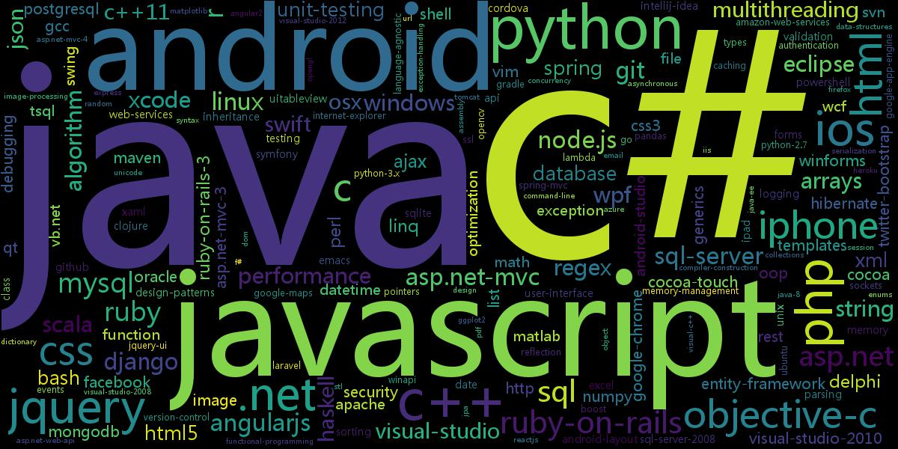

# Spider and Clustering

## Deadline

2017年12月23日，周六晚9点

### Recourses

[爬虫集合](https://github.com/facert/awesome-spider)

[如何学习Python爬虫[入门篇]？](https://zhuanlan.zhihu.com/p/21479334)

[Python入门网络爬虫之精华版](https://github.com/lining0806/PythonSpiderNotes)

[GitBook爬虫教程](https://piaosanlang.gitbooks.io/spiders/)

[*k*-平均算法 Wiki](https://zh.wikipedia.org/wiki/K-%E5%B9%B3%E5%9D%87%E7%AE%97%E6%B3%95#.E8.81.9A.E7.B1.BB.E5.88.86.E6.9E.90)

[sklearn.cluster.KMeans](http://scikit-learn.org/stable/modules/generated/sklearn.cluster.KMeans.html)

## Tasks

### 统计segmentfault上最受欢迎的编程语言

1. 在segmentfault社区中爬取最新的1million条问答，并按浏览量降序排序。

2. 对所有问题的tags进行统计，提取出总量前100的关键词。

3. 根据关键词的词频生成词云。如图：

   

### 对segmentfault的用户进行聚类划分

1. 在segmentfault社区中爬取所有用户的信息。

2. 选取特征利用机器学习的算法进行聚类划分(推荐：k-means算法)

   比如，根据用户编程语言的喜好，将segmentfault的所有用户划分为python选手,java选手,...

   **要求**：给出最终对用户信息的分类，可以通过不同的文件进行显示，如python.csv(包含所有python选手的信息)，java.csv(包含所有java选手的信息)...

