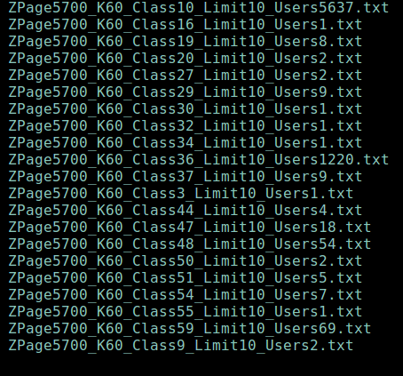

# segmenTfault社区爬虫

## 思路

  分为两个部分：抓取和分析，分别用两个程序实现

## 一、抓取

  将5700页内容分别抓取，从HTML中提取出用户名和标签，储存在5700个文件中，每个文件只有一行，格式为：

  用户1（空格）标签1-1（空格）标签1-2 …… 标签1-n（空格）用户2 ……

## 二、分析

### 1、统计用户和标签

遍历5700个文件，打开文件后用空格切分后遍历每个子字符串;将所有的用户名和标签按顺序加入两个列表。

### 2、构建矩阵统计每名用户帖子中每个标签出现的次数

构建一个 用户数×标签数 的zeros矩阵;

重复上述遍历，出现用户名时将后面的标签每出现一次就让矩阵中相应位置的元素 +1。

（因为遍历的文件相同，所以用户list，标签list，和矩阵中的每行和每列一一对应）

### 3、统计每个标签的出现总次数

将上述矩阵对 axis=0 求和再对照标签list 找出相应的标签名即可。

### 4、去除标签数过少的用户

同步删除用户list的元素 和 矩阵的行

### 5、使用K-means算法进行数据分析

输入设置的簇数K，

取用户list的前K个用户作为中心点开始递归分析;

设置一个有K个sublist的list，每个sublist代表一个簇，装入该簇中用户list中用户名的编号。

（将空簇去除）

格式为：

分析的页数——分的簇数——第几个簇——内含有多少个用户

 

## 三、总结

### 1、遇到的困难

（a）正则表达式比较难上手：最终发现需要用到的方法并不多。

（b）3000页的分析能做，4000页却不能：本来以为是内存不够用，后来觉得自己电脑不会这么渣，所以每读一页print一次，发现是因为有一个帖子中一个用户的名字带空格，这很奇怪，可能是网站错误，用户名中应该是不允许空格的吧，但也暴露了这个读取方法的局限，最后我很简单暴力地把这个空格删了于是世界和平。

（c）爬着爬着就停了：都是华科校园网害的，但是考虑到可以多线程爬取节省时间，但是由于精力有限（还有能够忍受这个速度）所以没有尝试。

（d）改写逻辑很烦人，突然想到一个更好的流程就重新开始写了。

### 2、有限的优化矩阵

（a）本来只打设置一个文件用于储存信息：考虑到内存问题，一次性将5700页的内容读入内存会有风险，所以改成每读取一页，存一个文件。

（b）去除了标签数过少的用户，对于那些发帖数较少的用户可能因为偶然性使算法更容易作出错误的分析，所以将其删除。

（c）先分析完用户和标签的个数来确定矩阵的大小再填入数据，相比每出现一个新用户和新标签就给矩阵加一行或一列可能来的更好，因为数据量太大，把矩阵“搬来搬去”应该不是一件好事（？）