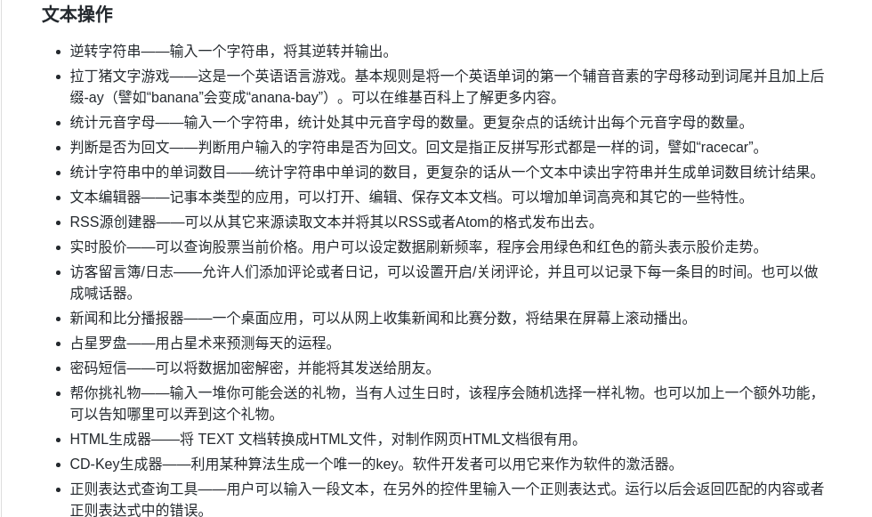

# Machine-Learning_Getting_Started

1. 阅读机器学习的经典入门书籍

[机器学习-周志华](http://www.chinacloud.cn/upload/2017-02/201702141641.pdf) (建议购买正版纸质书，相信以后也能用得到，好书还是要多资瓷～)

至少完成1-9章。

2. python编程练习

[python小项目](https://github.com/jobbole/ProgrammingProjectList)

完成其中的**文本操作**分类里的练习题，建议每天写一个。

3. (思考题)基于github上已有的跳一跳的外挂，开发一个具有自学习能力的、可以记录历史跳跃数据并利用机器学习算法优化程序自身参数(如时间系数)，从而不断提高跳跃精度和稳定性的版本。

   [python 微信《跳一跳》辅助](https://github.com/wangshub/wechat_jump_game)

